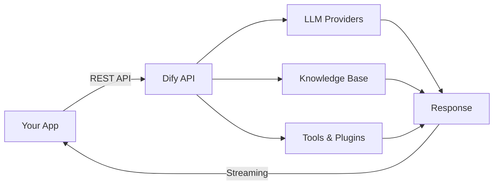

## What is Dify?

Dify is an open-source LLM application development platform that combines an intuitive visual interface with powerful backend infrastructure. It enables teams to go from prototype to production-ready AI applications without extensive machine learning expertise.

Whether you're building a customer support chatbot, a document intelligence pipeline, a multi-step agentic workflow, or a text generation tool, Dify provides the building blocks to ship quickly and iterate continuously.

<CardGroup cols={2}>
  <Card title="Quickstart" icon="rocket" href="/quickstart">
    Get your first AI application running in under 5 minutes
  </Card>
  <Card title="Key Concepts" icon="book" href="/key-concepts">
    Understand workflows, agents, RAG, and more
  </Card>
  <Card title="Dify Cloud" icon="cloud" href="/getting-started/cloud">
    Start immediately with zero infrastructure setup
  </Card>
  <Card title="Self-Hosting" icon="server" href="/getting-started/self-hosting">
    Deploy Dify in your own environment
  </Card>
</CardGroup>

## Core capabilities

<CardGroup cols={2}>
  <Card title="Visual Workflow Builder" icon="diagram-project" href="/features/workflow">
    Build and test powerful AI workflows on a drag-and-drop canvas. Chain LLM calls, data retrieval, code execution, and HTTP requests into production-ready pipelines.
  </Card>
  <Card title="Agentic AI" icon="robot" href="/features/agentic-ai">
    Define autonomous agents using LLM Function Calling or ReAct patterns. Equip them with 50+ built-in tools including web search, code execution, and image generation.
  </Card>
  <Card title="RAG Pipeline" icon="database" href="/features/rag-pipeline">
    Ingest documents (PDFs, PPTs, Word, web pages) into a knowledge base and power your apps with context-aware retrieval.
  </Card>
  <Card title="100+ Model Providers" icon="microchip" href="/features/model-support">
    Connect to OpenAI, Anthropic, Google Gemini, Mistral, Llama, and hundreds of other LLMs through a unified interface.
  </Card>
  <Card title="Prompt IDE" icon="code" href="/features/prompt-ide">
    Craft, test, and compare prompts interactively. Add text-to-speech, image inputs, and custom variables to your prompt templates.
  </Card>
  <Card title="LLMOps" icon="chart-line" href="/llmops/overview">
    Monitor application performance, annotate conversations, and continuously improve your models and prompts with production data.
  </Card>
</CardGroup>

## Application types

Dify supports four types of AI applications:

| Type | Description | Best for |
|------|-------------|----------|
| **Chatbot** | Conversational AI with memory and RAG | Customer support, Q&A assistants |
| **Text Generator** | Single-turn content generation | Writing tools, summarization, translation |
| **Agent** | Autonomous task execution with tools | Research, data analysis, automation |
| **Workflow** | Multi-step orchestrated pipelines | Complex business processes, data pipelines |

## How Dify works

1. **Build** your application using the visual Studio or configure it via API
2. **Connect** model providers, knowledge bases, and tools
3. **Deploy** your application to the cloud or your own infrastructure
4. **Integrate** via Dify's Backend-as-a-Service REST API
5. **Monitor** performance and iterate with the LLMOps dashboard

## Deployment options

<CardGroup cols={3}>
  <Card title="Dify Cloud" icon="cloud" href="/getting-started/cloud">
    Managed service with free tier. Zero infrastructure overhead.
  </Card>
  <Card title="Docker Compose" icon="docker" href="/getting-started/docker-compose">
    One-command self-hosted deployment for local and small-scale use.
  </Card>
  <Card title="Kubernetes" icon="server" href="/self-hosting/kubernetes">
    Production-scale highly-available deployment with Helm charts.
  </Card>
</CardGroup>

## Community & support

- **[GitHub Discussions](https://github.com/langgenius/dify/discussions)** — Share feedback and ask questions
- **[Discord](https://discord.gg/FngNHpbcY7)** — Join the community and share your applications
- **[GitHub Issues](https://github.com/langgenius/dify/issues)** — Report bugs and propose features
- **[X (Twitter)](https://twitter.com/dify_ai)** — Follow for updates and announcements
